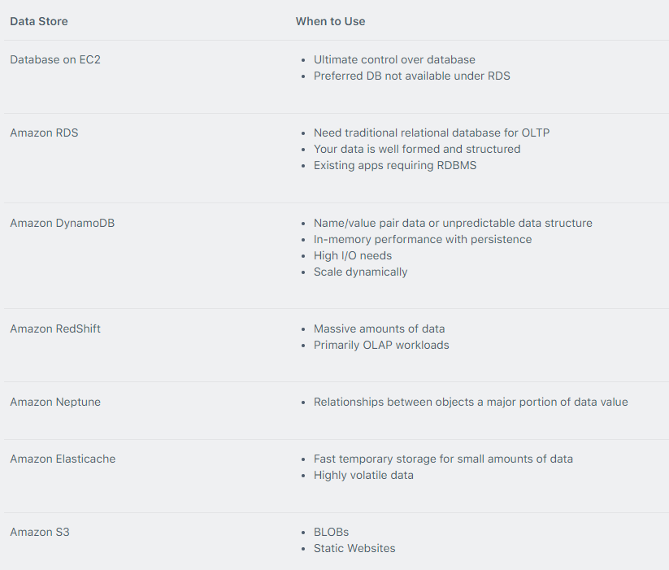

# AWS EC2
Amazon Elastic Compute Cloud (Amazon EC2) is a web service that provides resizable compute capacity in the cloud.

## valid EC2 lifecycle instance state

**1. Pending** - The instance is preparing to enter the running state. An instance enters the pending state when it launches for the first time, or when it is restarted after being in the stopped state.

**2. Running** - The instance is running and ready for use.

**3. Stopping** - The instance is preparing to be stopped. Take note that you will not billed if it is preparing to stop; however, you will still be billed if it is just preparing to hibernate.

**4. Stopped** - The instance is shut down and cannot be used. The instance can be restarted at any time.

**5. Shutting-down** - The instance is preparing to be terminated.
Terminated - The instance has been permanently deleted and cannot be restarted. Take note that Reserved Instances that are applied to terminated instances are still billed until the end of their term according to their payment option.

## Metadata and User Data:

- User data is data that is supplied by the user at instance launch in the form of a script.

- Instance metadata is data about your instance that you can use to configure or manage the running instance.

- Instance metadata is available at http://169.254.169.254/latest/meta-data/ (the trailing “/” is required).

- Instance user data is available at: http://169.254.169.254/latest/user-data.

## Billing and provisioning
**On demand**

- Pay for hours used with no commitment.

- Low cost and flexibility with no upfront cost.

- Ideal for auto scaling groups and unpredictable workloads.

- Good for dev/test.

**Spot**

- Spot Instances are available at up to a 90% discount compared to On-Demand prices.

- You can use Spot Instances for various stateless, fault-tolerant, or flexible applications such as big data, containerized workloads, CI/CD, web servers, high-performance computing (HPC), and other test & development workloads.

- You don’t have to bid for Spot Instances in the new pricing model, and you just pay the Spot price that’s in effect for the current hour for the instances that you launch.

- Spot Instances receive a two-minute interruption notice when these instances are about to be reclaimed by EC2, because EC2 needs the capacity back.

- Instances are not interrupted because of higher competing bids.

**Reserved**

- Purchase (or agree to purchase) usage of EC2 instances in advance for significant discounts over On-Demand pricing.

- Capacity is reserved for a term of 1 or 3 years.
- Can switch to AZ within the same region.
- Can change the instance size within the same instance type.
- Cannot change the instance size of Windows RIs.
- Can sell reservations on the AWS marketplace.
- If you don’t need your RI’s, you can try to sell them on the Reserved Instance Marketplace.

## Billing of EC2

- Billing commences when Amazon EC2 initiates the boot sequence of an AMI instance.

- Billing ends when the instance terminates, which could occur through a web services command, by running "shutdown -h", or through instance failure.
- AWS does charge for the storage of any Amazon EBS volumes.

- When you stop an instance, AWS shuts it down but doesn't charge hourly usage for a stopped instance or data transfer fees.

## IP Addresses

- Public IPv4 addresses are lost when the instance is stopped but private addresses (IPv4 and IPv6) are retained.

- Public IPv4 addresses are retained if you restart the instance.
Elastic IPs are retained when the instance is stopped.
- Elastic IP addresses are static public IP addresses that can be remapped (moved) between instances.
- All accounts are limited to 5 elastic IPs per region by default; however this is a soft limit which can be raised by a service limit increase to AWS Support.
- AWS charges for elastic IP’s when they’re not being used.
- An Elastic IP address is for use in a specific region only.
- When you stop and start an EC2 instance, it will generally be moved to different underlying hardware.

## Placement Group
**Cluster:** cluster instances into low latency groups in single Availability zone. Cluster placement groups are recommended for applications that benefit from low network latency, high network throughput, or both. They are also recommended when the majority of the network traffic is between the instances in the group.

**Spread:** spreads instances across underlying hardware (max 7 instances per group per AZ). Spread placement groups are recommended for applications that have a small number of critical instances that should be kept separate from each other.

**Partition:** Partition placement groups help reduce the likelihood of correlated hardware failures for your application. When using partition placement groups, Amazon EC2 divides each group into logical segments called partitions. Amazon EC2 ensures that each partition within a placement group has its own set of racks. Scales to 100s of EC2 instances per group. Partition placement groups can be used to deploy large distributed and replicated workloads, such as HDFS, HBase, and Cassandra, across distinct racks.

## Elastic Network Interfaces

- An elastic network interface (referred to as a network interface) is a logical networking component in a VPC that represents a virtual network card.

- You cannot increase the network bandwidth of an instance by teaming multiple ENIs.

- You can only add one extra ENI when launching but more can be attached later.

- eth0 is the primary network interface and cannot be moved or detached.

- By default, eth0 is the only Elastic Network Interface (ENI) created with an EC2 instance when launched.

**A network interface can include the following attributes:**

- A primary private IPv4 address from the IPv4 address range of your VPC.

- One or more secondary private IPv4 addresses from the IPv4 address range of your VPC.

- One Elastic IP address (IPv4) per private IPv4 address.

- One public IPv4 address.

- One or more IPv6 addresses.

-One or more security groups.

- A MAC address.

- A source/destination check flag.

- A description.

## Attaching ENIs

- ENIs can be “hot attached” to running instances.

- ENIs can be “warm-attached” when the instance is stopped.

- ENIs can be “cold-attached” when the instance is launched.

- Default interfaces are terminated with instance termination.

- Manually added interfaces are not terminated by default.

- You can change the termination behavior.

## Interface endpoints
An interface endpoint is an elastic network interface with a private IP address from the IP address range of your subnet. It serves as an entry point for traffic destined to a service that is owned by AWS or owned by an AWS customer or partner.

## Enhanced Networking – Elastic Network Adapter (ENA)
Enhanced networking provides higher bandwidth, higher packet-per-second (PPS) performance, and consistently lower inter-instance latencies. Enhanced networking is enabled using an Elastic Network Adapter (ENA).

- If your packets-per-second rate appears to have reached its ceiling, you should consider moving to enhanced networking because you have likely reached the upper thresholds of the VIF driver.

- AWS currently supports enhanced networking capabilities using SR-IOV

- SR-IOV provides direct access to network adapters, provides higher performance (packets-per-second) and lower latency.

- Must launch an HVM AMI with the appropriate drivers.

- Only available for certain instance types.

- Only supported in an Amazon VPC.

## Elastic Fabric Adapter (EFA)
An Elastic Fabric Adapter is an AWS Elastic Network Adapter (ENA) with added capabilities. An EFA can still handle IP traffic, but also supports an important access model commonly called OS bypass.

This model allows the application (most commonly through some user-space middleware) to access the network interface without having to get the operating system involved with each message.

**Use cases for EFAs include**

- High Performance Computing (HPC) applications using the Message Passing Interface (MPI).

- Machine Learning (ML) applications using NVIDIA Collective Communications Library (NCCL).

- With EFA you get the application performance of on-premises HPC clusters with the on-demand elasticity and flexibility of the AWS cloud.

- EFA is available as an optional EC2 networking feature that you can enable on any supported EC2 instance at no additional cost.

## ENI vs ENA vs EFA
**When to use ENI:**

- This is the basic adapter type for when you don’t have any high-performance requirements.

- Can be used with all instance types.

**When to use ENA:**

- Good for use cases that require higher bandwidth and lower inter-instance latency.

- Supported for limited instance types (HVM only).

**When to use EFA:**

- High Performance Computing.

- MPI and ML use cases.

- Tightly coupled applications.

- Can be used with all instance types.

# API Gateway
Together with Lambda, API Gateway forms the app-facing part of the AWS serverless infrastructure.

- Creating, deploying, and managing a REST application programming interface (API) to expose backend HTTP endpoints, AWS Lambda functions, or other AWS services.

- Creating, deploying, and managing a WebSocket API to expose AWS Lambda functions or other AWS services.

- Invoking exposed API methods through the frontend HTTP and WebSocket endpoints.

- Back-end services include Amazon EC2, AWS Lambda or any web application (public or private endpoints).

## Edge-Optimized Endpoint

- An edge-optimized API endpoint is best for geographically distributed clients. API requests are routed to the nearest CloudFront Point of Presence (POP). This is the default endpoint type for API Gateway REST APIs.

- Edge-optimized APIs capitalize the names of HTTP headers (for example, Cookie).

- CloudFront sorts HTTP cookies in natural order by cookie name before forwarding the request to your origin. For more information about the way CloudFront processes cookies, see Caching Content Based on Cookies.

- Any custom domain name that you use for an edge-optimized API applies across all regions.

## Identity and Access Management

- Resource-based policies.

- Standard IAM Roles and Policies (identity-based policies).

- IAM Tags.

- Endpoint policies for interface VPC endpoints. Lambda authorizers.

- Amazon Cognito user pools.

## Charges

- With Amazon API Gateway, you only pay when your APIs are in use.

- There are no minimum fees or upfront commitments.

- You pay only for the API calls you receive, and the amount of data transferred out.

- There are no data transfer out charges for Private APIs (however, AWS PrivateLink charges apply when using Private APIs in Amazon API Gateway).

- Amazon API Gateway also provides optional data caching charged at an hourly rate that varies based on the cache size you select.

- The API Gateway free tier includes one million API calls per month for up to 12 months.

# AWS Lambda
- To enable your Lambda function to access resources inside your private VPC, you must provide additional VPC-specific configuration information that includes VPC subnet IDs and security group IDs.

- Max is 15 minutes (900 seconds), default is 3 seconds.

- You pay for the time it runs.

- Lambda terminates the function at the timeout.

- Lambda assumes an IAM role when it executes the function.

- Lambda scales concurrently executing functions up to your default limit (1000).

- Application Load Balancers (ALBs) support AWS Lambda functions as targets.

**Exam tip:** If a Lambda function needs to connect to a VPC and needs Internet access, make sure you connect to a private subnet that has a route to a NAT Gateway (the NAT Gateway will be in a public subnet).

## Supported AWS event sources include

1. Amazon S3.
2. Amazon DynamoDB.
3. Amazon Kinesis Data Streams.
4. Amazon Simple Notification Service.
5. Amazon Simple Email Service.
6. Amazon Simple Queue Service.
7. Amazon Cognito.
8. AWS CloudFormation.
9. Amazon CloudWatch Logs.
10. Amazon CloudWatch Events.
11. AWS CodeCommit.
12. AWS Config.
13. Amazon Alexa.
14. Amazon Lex.
15. Amazon API Gateway.
16. AWS IoT Button.
17. Amazon CloudFront.
18. Amazon Kinesis Data Firehose.

## Services that Lambda reads events from:

1. Amazon Kinesis
2. Amazon DynamoDB
3. Amazon Simple Queue Service

## Dead Letter Queue (DLQ)

A dead-letter queue saves discarded events for further processing. A dead-letter queue acts the same as an on-failure destination in that it is used when an event fails all processing attempts or expires without being processed.

## Lambda@Edge

Lambda@Edge allows you to run code across AWS locations globally without provisioning or managing servers, responding to end users at the lowest network latency.

The functions run in response to CloudFront events, without provisioning or managing servers.

## ELB

- The Lambda function and target group must be in the same account and in the same Region.

- The maximum size of the request body that you can send to a Lambda function is 1 MB.

- The maximum size of the response JSON that the Lambda function can send is 1 MB.

- WebSockets are not supported. Upgrade requests are rejected with an HTTP 400 code.

- By default, health checks are disabled for target groups of type lambda.

- You can enable health checks to implement DNS failover with Amazon Route 53. The Lambda function can check the health of a downstream service before responding to the health check request.

## Operations and Monitoring

- Lambda automatically monitors Lambda functions and reports metrics through CloudWatch.

- You can use AWS X-Ray to visualize the components of your application, identify performance bottlenecks, and troubleshoot requests that resulted in an error.

- Must have permissions to write to X-Ray in the execution role.

## Charges

- Number of requests.
- Duration of the request calculated from the time your code begins execution until it returns or terminates.
- The amount of memory allocated to the function.

# Amazon RDS
- Amazon RDS is an Online Transaction Processing (OLTP) type of database.
- It is best suited to structured, relational data store requirements.
- Automated backups and patching are applied in customer-defined maintenance windows.
- RDS is a managed service and you do not have access to the underlying EC2 instance.
- Database instances are accessed via endpoints.
- Endpoints can be retrieved via the DB instance description in the AWS Management Console, DescribeDBInstances API or describe-db-instances command.

**Amazon RDS supports the following database engines:**
1. Amazon Aurora.
2. MySQL.
3. MariaDB.
4. Oracle.
5. SQL Server.
6. PostgreSQL.

**The Amazon RDS managed service includes the following:**
1. Security and patching of the DB instances.
2. Automated backup for the DB instances.
3. Software updates for the DB engine.
4. Easy scaling for storage and compute.
5. Multi-AZ option with synchronous replication.
6. Automatic failover for Multi-AZ option.
7. Read replicas option for read heavy workloads.

You can have up to 40 Amazon RDS DB instances, with the following limitations:
1. 10 for each SQL Server edition (Enterprise, Standard, Web, and Express) under the "license-included" model
2. 10 for Oracle under the "license-included" model
3. 40 for MySQL, MariaDB, or PostgreSQL
4. 40 for Oracle under the "bring-your-own-license" (BYOL) licensing model.

**IAM DB authentication**
We can authenticate to your DB instance using AWS Identity and Access Management (IAM) database authentication. IAM database authentication works with MariaDB, MySQL, and PostgreSQL. With this authentication method, you don't need to use a password when you connect to a DB instance. Instead, you use an authentication token.
***Advantages:***
1. Network traffic to and from the database is encrypted using Secure Socket Layer (SSL) or Transport Layer Security (TLS). 
2. You can use IAM to centrally manage access to your database resources, instead of managing access individually on each DB instance.
3. For applications running on Amazon EC2, you can use profile credentials specific to your EC2 instance to access your database instead of a password, for greater security.

# Encryption
- Encryption at rest is supported for all DB types and uses AWS KMS.
- You cannot encrypt an existing DB, you need to create a snapshot, copy it, encrypt the copy, then build an encrypted DB from the snapshot.
- A Read Replica of an Amazon RDS encrypted instance is also encrypted using the same key as the master instance when both are in the same region.
- If the master and Read Replica are in different regions, you encrypt using the encryption key for that region.
- You can’t have an encrypted Read Replica of an unencrypted DB instance or an unencrypted Read Replica of an encrypted DB instance.

**When using encryption at rest the following elements are also encrypted:**
1. All DB snapshots.
2. Backups.
3. DB instance storage.
4. Read Replicas.

## Billing and Provisioning
1. DB instance hours (partial hours are charged as full hours).
2. Storage GB/month.
3. I/O requests/month – for magnetic storage.
4. Provisioned IOPS/month – for RDS provisioned IOPS SSD.
5. Egress data transfer.
6. Backup storage (DB backups and manual snapshots).

## Multi AZ and Read Replicas
**Failover**
1. Loss of primary AZ or primary DB instance failure.
2. Loss of network connectivity on primary.
3. Compute (EC2) unit failure on primary.
4. Storage (EBS) unit failure on primary.
5. The primary DB instance is changed.
6. Patching of the OS on the primary DB instance.
7. Manual failover (reboot with failover selected on primary)

**Read Replicas**
- Read replicas are used for read-heavy DBs and replication is asynchronous.
- Read replicas are for workload sharing and offloading.
- Read replicas provide read-only DR.
- Read replicas are created from a snapshot of the master instance.
- Must have automated backups enabled on the primary (retention period > 0).
- Read replicas are available for MySQL, PostgreSQL, MariaDB, Oracle, Aurora, and SQL Server.
- Up to 5 Read Replicas.
- Replication is ASYNC, so reads re eventually consistent.
- Replicas  can be promoted to their own DB.
- Applications must update the connection string to leverage read replicas.
- If data goes from one AZ to another then it is charged. Data transfer within AZ no charge.

# DBsnapshots
- Automatic backup can be stored from 0 to 35 days max.
- DB Snapshots are user-initiated and enable you to back up your DB instance in a known state as frequently as you wish, and then restore to that specific state.
- Cannot be used for point-in-time recovery.
- Manual backup can be taken from secondary database so there is no downtime of database.
- OS and DB patching can require taking the database offline.
- By default maintenance is set for weekly, we can change it.
- Snapshots are stored on S3.
- Snapshots remain on S3 until manually deleted.
- Can restore up to the last 5 minutes.
- Only default DB parameters and security groups are restored – you must manually associate all other DB parameters and SGs.
- Snapshots can be shared with other AWS accounts.

# High Availability Approaches for Databases
1. If possible, choose DynamoDB over RDS because of inherent fault tolerance.
2. If DynamoDB can’t be used, choose Aurora because of redundancy and automatic recovery features.
3. If Aurora can’t be used, choose Multi-AZ RDS.

# Migration
- AWS Database Migration Service helps you migrate databases to AWS quickly and securely.
- Use along with the Schema Conversion Tool (SCT) to migrate databases to AWS RDS or EC2-based databases.
- The source database remains fully operational during the migration, minimizing downtime to applications that rely on the database.
- Schema Conversion Tool can copy database schemas for homogenous migrations (same database) and convert schemas for heterogeneous migrations (different database).

## RDS Conversion from Single AZ to Multi AZ
- No down time when creating multi AZ from single instance DB. Below steps are performed when we modify single instance DB to multi AZ DB.
- A snapshot is taken.
- A new DB is restored from the snapshot in new AZ.
- Synchronization is established between the two databases.

## Converting unencrypted database to encrypted database
- Take snapshot of existing unencrypted database.
- copy snapshort to an encrypted snapshot.
- Create a new database from that encrypted database.

# Monitoring, Logging and Reporting
**1. Amazon RDS Events** – Subscribe to Amazon RDS events to be notified when changes occur with a DB instance, DB snapshot, DB parameter group, or DB security group.
**2. Database log files** – View, download, or watch database log files using the Amazon RDS console or Amazon RDS API operations. You can also query some database log files that are loaded into database tables.
**3. Amazon RDS Enhanced Monitoring** — Look at metrics in real time for the operating system.
**4. Amazon RDS Performance Insights** — Assess the load on your database and determine when and where to act.
**5. Amazon RDS Recommendations** — Look at automated recommendations for database resources, such as DB instances, read replicas, and DB parameter groups.

# Amazon Aurora
- Aurora is an AWS proprietary database.
- 2 copies of data are kept in each AZ with a minimum of 3 AZ’s (6 copies).
- Can handle the loss of up to two copies of data without affecting DB write availability and up to three copies without affecting read availability.

**Aurora Replicas**
1. Aurora replica (up to 15)
2. MySQL Read Replica (up to 5)

**Global Database**
For globally distributed applications you can use Global Database, where a single Aurora database can span multiple AWS regions to enable fast local reads and quick disaster recovery. Global Database uses storage-based replication to replicate a database across multiple AWS Regions, with typical latency of less than 1 second.

**Architecture**
An Aurora cluster consists of a set of **compute (database)** nodes and a shared **storage volume**.
The storage volume consists of **six storage nodes** placed in **three Availability Zones** for high availability and durability of user data.

# Aurora Serverless
- Available for MySQL-compatible and PostgreSQL-compatible editions.
- With Aurora Serverless, you only pay for database storage and the database capacity and I/O your database consumes while it is active.
- Can migrate between standard and serverless configurations with a few clicks in the Amazon RDS Management Console.

# Backup and Restore
1. Amazon Aurora’s backup capability enables point-in-time recovery for your instance.
2. Your automatic backup retention period can be configured up to thirty-five days.
3. Automated backups are enabled by default and data is stored on S3 and is equal to the size of the DB.
4. When automated backups are turned on for your DB Instance, Amazon RDS automatically performs a full daily snapshot of your data (during your preferred backup window).
5. Amazon RDS retains backups of a DB Instance for a limited, default is 7 days but can be up to 35 days.
6. The DB instance must be in an Active state for automated backups to happen.
7. The granularity of point-in-time recovery is 5 minutes.

**Aurora DB failover**
1. If you have an Amazon Aurora Replica in the same or a different Availability Zone, when failing over, Amazon Aurora flips the canonical name record (CNAME) for your DB Instance to point at the healthy replica, which in turn is promoted to become the new primary. Start-to-finish, failover typically completes within 30 seconds.
2. If you are running Aurora Serverless and the DB instance or AZ becomes unavailable, Aurora will automatically recreate the DB instance in a different AZ.
3. If you do not have an Amazon Aurora Replica (i.e. single instance) and are not running Aurora Serverless, Aurora will attempt to create a new DB Instance in the same Availability Zone as the original instance. This replacement of the original instance is done on a best-effort basis and may not succeed.

**Retention periods:**
1. By default the retention period is 7 days if configured from the console for all DB engines except Aurora.
2. The default retention period is 1 day if configured from the API or CLI.
3. The retention period for Aurora is 1 day regardless of how it is configured.
4. You can increase the retention period up to 35 days.
5. During the backup window I/O may be suspended.
6. Automated backups are deleted when you delete the RDS DB instance.
7. Automated backups are only supported for InnoDB storage engine for MySQL (not for myISAM).

# Dynamo DB
Amazon DynamoDB is a fully managed NoSQL database service that provides fast and predictable performance with seamless scalability.
- Amazon DynamoDB stores three geographically distributed replicas of each table to enable high availability and data durability.
- Data is synchronously replicated across 3 facilities (AZs) in a region.
- DynamoDB is a serverless service – there are no instances to provision or manage.
- DynamoDB can be used for storing session state data.

**DynamoDB is made up of:**
**1. Tables:** Tables are a collection of items and items are made up of attributes (columns).
**2. Items:** The aggregate size of an item cannot exceed 400KB including keys and all attributes.
**3. Attributes:** Attributes consists of a name and a value or set of values.

**DynamoDB Accelerator (DAX)**
Fully managed in-memory cache for DynamoDB that increases performance (microsecond latency). You do not need to modify application logic, since DAX is compatible with existing DynamoDB API calls.

**DAX is used to improve READ performance (not writes).**

**Working**
1. DAX is a write-through caching service – this means the data is written to the cache as well as the back-end store at the same time.
2. Allows you to point your DynamoDB API calls at the DAX cluster and if the item is in the cache (cache hit), DAX returns the result to the application.
3. If the item requested is not in the cache (cache miss) then DAX performs an Eventually Consistent GetItem operation against DynamoDB
4. Retrieval of data from DAX reduces the read load on DynamoDB tables.
5. This may result in being able to reduce the provisioned read capacity on the table.

**Dynamo DB streams**
DynamoDB Streams captures a time-ordered sequence of item-level modifications in any DynamoDB table and stores this information in a log for up to 24 hours. Events are recorded in near real-time.

**Dynamo DB Global Tables**

**Access Control**
All authentication and access control is managed using IAM.
DynamoDB supports identity-based policies.
DynamoDB doesn’t support resource-based policies.
In DynamoDB, the primary resources are tables. Additional resource types, indexes, and streams can be created.

# Elasticache
- Fully managed implementations of two popular in-memory data stores – Redis and Memcached.
- Best for scenarios where the DB load is based on Online Analytics Processing (OLAP) transactions.
- Billed by node size and hours of use.

**There are two types of ElastiCache engine:**
1. **Memcached** – simplest model, can run large nodes with multiple cores/threads, can be scaled in and out, can cache objects such as DBs.
2. **Redis** – complex model, supports encryption, master / slave replication, cross AZ (HA), automatic failover and backup/restore.

# Patterns
**Lazy Loading**
1. Loads the data into the cache only when necessary (if a cache miss occurs).
2. Lazy loading avoids filling up the cache with data that won’t be requested.
3. If requested data is in the cache, ElastiCache returns the data to the application.
4. If the data is not in the cache or has expired, ElastiCache returns a null.
5. The application then fetches the data from the database and writes the data received into the cache so that it is available for next time.
6. Data in the cache can become stale if Lazy Loading is implemented without other strategies (such as TTL).

**Write Through**
1. When using a write-through strategy, the cache is updated whenever a new write or update is made to the underlying database.
2. Allows cache data to remain up to date.
3. This can add wait time to write operations in your application.
4. Without a TTL you can end up with a lot of cached data that is never read.

# Monitoring and Reporting
**Memcached Metrics**
1.  CloudWatch metrics:
2.  CPUUtilization
3.  SwapUsage
4.  Evictions
5.  CurrConnections 

**Redis Metrics**
1. CloudWatch metrics:
2. EngineCPUUtilization
3. MemoryFragmentationRatio 
4. CacheHits
5. CacheMisses
6. CacheHitRate
7. CurrConnections

# Amazon RedShift
Amazon Redshift is a fast, fully managed data warehouse that makes it simple and cost-effective to analyze all your data using standard SQL and existing Business Intelligence (BI) tools.

RedShift is an Online Analytics Processing (OLAP) type of DB.

Multi-node consists of:
Leader node:
- Manages client connections and receives queries.
- Simple SQL endpoint.
- Stores metadata.
- Optimizes query plan.
- Coordinates query execution.

Compute nodes:
- Stores data and performs queries and computations.
- Local columnar storage.
- Parallel/distributed execution of all queries, loads, backups, restores, resizes.
- Up to 128 compute nodes.

**Availability and Durability**
Only available in one AZ but you can restore snapshots into another AZ.
Alternatively, you can run data warehouse clusters in multiple AZ’s by loading data into two Amazon Redshift data warehouse clusters in separate AZs from the same set of Amazon S3 input files.

RedShift provides continuous/incremental backups.

RedShift always keeps three copies of your data:
1. The original.
2. A replica on compute nodes (within the cluster).
3. A backup copy on S3.

# Amazon EMR
It is a managed cluster platform that simplifies running big data frameworks, such as Apache Hadoop and Apache Spark, on AWS to process and analyze vast amounts of data. 
- Runs in one Availability Zone within an Amazon VPC.
- Supports Apache Spark, HBase, Presto and Flink.
- Most used for log analysis, financial analysis, or extract, translate and loading (ETL) activities.

# Amazon Kinesis
Amazon Kinesis makes it easy to collect, process, and analyze real-time, streaming data so you can get timely insights and react quickly to new information.
- Data is processed in “shards” – with each shard able to ingest 1000 records per second.
- There is a default limit of 500 shards, but you can request an increase to unlimited shards.

There are four types of Kinesis service:
1. Kinesis Video Streams
2. Kinesis Data Streams
3. Kinesis Data Firehose
4. Kinesis Data Analytics

# Kinesis Video Streams
Kinesis Video Streams makes it easy to securely stream video from connected devices to AWS for analytics, machine learning (ML), and other processing. It stores data in shards, stores data for 24 hours by default, up to 7 days.

# Kinesis Data Streams
Kinesis Data Streams enables real-time processing of streaming big data. Kinesis Data Streams stores data for later processing by applications (key difference with Firehose which delivers data directly to AWS services).

By default, records of a stream are accessible for up to 24 hours from the time they are added to the stream (can be raised to 7 days by enabling extended data retention).

# Kinesis Data Firehose
Kinesis Data Firehose is the easiest way to load streaming data into data stores and analytics tools. Enables near real-time analytics with existing business intelligence tools and dashboards. Kinesis Data Streams can be used as the source(s) to Kinesis Data Firehose.

**Firehose Destinations include:**
1. Amazon S3.
2. Amazon Redshift.
3. Amazon Elasticsearch Service.
4. Splunk.

# Kinesis Data Analytics
Amazon Kinesis Data Analytics is the easiest way to process and analyze real-time, streaming data. It can use standard SQL queries to process Kinesis data streams.
- Can ingest data from Kinesis Streams and Kinesis Firehose.
- Output to S3, RedShift, Elasticsearch and Kinesis Data Streams.

# Amazon Athena
1. Amazon Athena is an interactive query service that makes it easy to analyze data in Amazon S3 using standard SQL.
2. While Amazon Athena is ideal for quick, ad-hoc querying and integrates with Amazon QuickSight for easy visualization, it can also handle complex analysis, including large joins, window functions, and arrays.
3. Amazon Athena integrates directly with Identity and Access Management and you can leverage the use of bucket policies within S3 also. 

**Pricing**
- With Amazon Athena, you pay only for the queries that you run.
- You are charged based on the amount of data scanned by each query.
- You can get significant cost savings and performance gains by compressing, partitioning, or converting your data to a columnar format, because each of those operations reduces the amount of data that Athena needs to scan to execute a query.

# AWS Glue
AWS Glue is just a serverless ETL service that crawls your data, builds a data catalog, performs data preparation, data transformation, and data ingestion. It won't allow you to utilize different big data frameworks effectively, unlike Amazon EMR.

# Elastic Block Store (EBS)
Amazon Elastic Block Store (Amazon EBS) provides block level storage volumes for use with EC2 instances. EBS volumes behave like raw, unformatted block devices.
- You can have up to 5,000 EBS volumes by default.
- You can have up to 10,000 snapshots by default.

When you create an encrypted EBS volume and attach it to a supported instance type, the following types of data are encrypted:
1. Data at rest inside the volume
2. All data moving between the volume and the instance
3. All snapshots created from the volume
4. All volumes created from those snapshots

 Amazon EBS is recommended for data that must be quickly accessible and requires long-term persistence. EBS volumes are particularly well-suited for use as the primary storage for file systems, databases, or for any applications that require fine granular updates and access to raw, unformatted, block-level storage. Amazon EBS is well suited to both database-style applications that rely on random reads and writes, and to throughput-intensive applications that perform long, continuous reads and writes.
 
 ## Features
 - It is AZ locked i.e. EBS created in one AZ will not be available in other AZ.
-  To make a volume available outside of the Availability Zone, we can create a snapshot and restore that snapshot to a new volume anywhere in that Region. You can copy snapshots to other Regions and then restore them to new volumes there, making it easier to leverage multiple AWS Regions for geographical expansion, data center migration, and disaster recovery.

## Instance Store
- An instance store provides temporary block-level storage for your instance. This storage is located on disks that are physically attached to the host computer. 
-  Instance store is ideal for temporary storage of information that changes frequently, such as buffers, caches, scratch data, and other temporary content, or for data that is replicated across a fleet of instances, such as a load-balanced pool of web servers.
-  You can specify instance store volumes for an instance only when you launch it. You can't detach an instance store volume from one instance and attach it to a different instance.
-  ELB is designed to only run in one region and not across multiple regions.
-  EBS volumes are only encrypted using AWS KMS. Server-side encryption (SSE) is actually an option for Amazon S3.

**EBS volume trype**
1. SSD, General Purpose – gp2/gp3
2. SSD, Provisioned IOPS – io1/io2
3. HDD, Throughput Optimized – (st1)
4. HDD, Cold – (sc1)
5. EBS optimized instances

**SSD, General Purpose – gp2/gp3**
General Purpose SSD volume that balances price performance for a wide variety of transactional workloads.

Use cases:
- Boot volumes, low-latency interactive apps, dev & test.
- EBS multi-attach not supported.

**SSD, Provisioned IOPS – io1/io2**
Highest performance SSD volume designed for latency-sensitive transactional workloads

Use cases:
- Workloads that require sustained IOPS performance or more than 16,000 IOPS.
- I/O-intensive NoSQL and relational databases.
- EBS multi-attach supported.

**HDD, Throughput Optimized – (st1)**
Low-cost HDD volume, designed for frequently accessed. Throughput intensive workloads

- Frequently accessed, throughput intensive workloads with large datasets and large I/O sizes, such as MapReduce, Kafka, log processing, data warehouse, and ETL workloads.
- Cannot be a boot volume.
- EBS multi-attach not supported.

Use case:
- Big-data, data warehouses, log processing.

**HDD, Cold – (sc1)**
Lowest cost HDD volume designed for less frequently accessed workloads
- Lowest cost storage – cannot be a boot volume.
- Less frequently accessed workloads with large, cold datasets.
- Cannot be a boot volume.
- EBS multi-attach not supported.

Use case:
- Colder data requiring fewer scans per day.

**EBS optimized instances**
- Dedicated capacity for Amazon EBS I/O.
- EBS-optimized instances are designed for use with all EBS volume types.
- Additional hourly fee.
- Available for select instance types.
- Some instance types have EBS-optimized enabled by default.

# EBS Encryption
 When you create an encrypted EBS volume and attach it to a supported instance type, the following types of data are encrypted:
1.  Data at rest inside the volume.
2. All data moving between the volume and the instance.
3. All snapshots created from the volume.
4. All volumes created from those snapshots.

## EBS Snapshots
1. Snapshots are created asynchronously and are incremental.
2. You can copy unencrypted snapshots (optionally encrypt).
3. You can copy an encrypted snapshot (optionally re-encrypt with a different key).
4. Snapshot copies receive a new unique ID.
5. You can copy within or between regions.
6. You cannot move snapshots, only copy them.
7. You cannot take a copy of a snapshot when it is in a “pending” state, it must be “complete”.
8. S3 Server Side Encryption (SSE) protects data in transit while copying.
9. User defined tags are not copied.
10. You can have up to 5 snapshot copy requests running in a single destination per account.
11. You can copy Import/Export service, AWS Marketplace, and AWS Storage Gateway snapshots.
12. If you try to copy an encrypted snapshot without having access to the encryption keys it will fail silently (cross-account permissions are required).

**Use case for copying snapshots**
- Creating services in other regions.
- DR – the ability to restore from snapshot in another region.
- Migration to another region.
- Applying encryption.
- Data retention.

**Snapshot of RAID arrays**
1. Stop the application from writing to disk.
2. Flush all caches to the disk.
3. Freeze the filesystem.
4. Unmount the RAID array.
5. Shut down the associated EC2 instance.

# Monitoring and Reporting
There are two types of Amazon CloudWatch monitoring available for Amazon EBS volumes:
**1. Basic** – Data is available automatically in 5-minute periods at no charge. This includes data for the root device volumes for EBS-backed instances.
**2. Detailed** – Provisioned IOPS SSD (io1) volumes automatically send one-minute metrics to CloudWatch.

- Amazon EBS General Purpose SSD (gp2), Throughput Optimized HDD (st1) , Cold HDD (sc1), and Magnetic (standard) volumes automatically send five-minute metrics to CloudWatch.
- Provisioned IOPS SSD (io1) volumes automatically send one-minute metrics to CloudWatch.
- Data is only reported to CloudWatch when the volume is attached to an instance.

# EFS
Amazon Elastic File System (Amazon EFS) provides a simple, serverless, set-and-forget elastic file system for use with AWS Cloud services and on-premises resources.
- Amazon EFS supports the Network File System version 4 (NFSv4.1 and NFSv4.0) protocol
- Multiple compute instances, including Amazon EC2, Amazon ECS, and AWS Lambda, can access an Amazon EFS file system at the same time.
- Data is stored across multiple AZs within a region.
- Need to create mount targets and choose AZs to include.

 ## Amazon EFS offers a range of storage classes designed for different use cases:
**Standard storage classes** – EFS Standard and EFS Standard–Infrequent Access (Standard–IA), which offer multi-AZ resilience and the highest levels of durability and availability.
**One Zone storage classes** – EFS One Zone and EFS One Zone–Infrequent Access (EFS One Zone–IA), which offer customers the choice of additional savings by choosing to save their data in a single Availability Zone.

## Amazon EFS Performance
**Performance Modes**
1. “General Purpose” performance mode is appropriate for most file systems.
2. “Max I/O” performance mode is optimized for applications where tens, hundreds, or thousands of EC2 instances are accessing the file system.

## Throughput Modes
1. **Burst Throughput:** Throughput scales as your file system grows.
2. **Provisioned Throughput:** Throughput is fixed at the specified amount.

# Amazon EFS Encryption
- EFS offers the ability to encrypt data at rest and in transit.
- Encryption keys are managed by the AWS Key Management Service (KMS).

## Encryption in Transit
- Data encryption in transit uses Transport Layer Security (TLS) 1.2 to encrypt data sent between your clients and EFS file systems.
- Encryption in transit is enabled when mounting the file system.

## Encryption at rest
1. Enable encryption at rest in the EFS console or by using the AWS CLI or SDKs.
2. Encryption at rest MUST be enabled at file system creation time.
3. Data encrypted at rest is transparently encrypted while being written, and transparently decrypted while being read.

# FSx for Windows

# FSx for Lustre

# FSx File system Deployment Options

# Glacier
## Data Transfer from Snowball into Glacier

## Retrieval Options in Glacier
1. **Expedited:** Retrieval in 1-5 mins if data retrieved is <250MB.
2. **Standard:** 3-5 hours, no limit on data size.
3. **Bulk:** To retrieve petabyte of data and takes 5-12 hrs.

There are 2 types of Hybrid Cloud Storage:
1. AWS Storage Gateway
2. AWS Snow Family

# AWS Storage Gateway
It is a hybrid cloud storage service that gives you on-premises access to virtually unlimited cloud storage. You can use Storage Gateway to simplify storage management and reduce costs for key hybrid cloud storage use cases. These include moving backups to the cloud, using on-premises file shares backed by cloud storage, and providing low-latency access to data in AWS for on-premises applications.

The service provides four different types of gateways:
1. Tape Gateway
2. Amazon S3 File Gateway,
3. Amazon FSx File Gateway
4. Volume Gateway

## Storage Gateway

# File Gateway
Amazon File Gateway presents a file interface that enables you to store files as objects in Amazon S3 using the industry-standard NFS and SMB file protocols, and access those files via NFS and SMB from your data center or Amazon EC2, or access those files as objects directly in Amazon S3. Once objects are transferred to S3, they can be managed as native S3 objects and bucket policies such as lifecycle management and Cross-Region Replication (CRR), and can be applied directly to objects stored in your bucket.

# Amazon FSx File Gateway

# Tape Gateway
Tape Gateway presents an iSCSI-based virtual tape library (VTL) of virtual tape drives and a virtual media changer to your on-premises backup application. It is compatible with most leading backup applications, so you can continue using your tape-based backup workflows.
- You can access your data stored as virtual tapes in AWS through a Tape Gateway running in AWS or in your data center over the network.
-  You pay only for the capacity you use and scale as your needs grow.
- For any petabyte-scale tape data migration needs you can use a Snowball Edge Storage Optimized device with Tape Gateway to move your physical tape data to either S3 Glacier Flexible Retrieval or S3 Glacier Deep Archive.
- 

# Volume Gateway

# Summary

# Migration Services
## AWS Application Discovery Service
- Helps enterprise customers plan migration projects.
- Gathers information about the customers on-premises resources.
- Enable customers to understand the configuration, usuage and behavoir of servers in their IT environments.
- An **AWS Discovery agent** is required to be installed on on-premise servers or VM to capture system configuration, system performance, running processes etc.
- It helps to discover technical details of applications running on on-premise data center.

## Database Migration Services
- Supports both homogenous and heterogenous DB migration.

## AWS Server Migration
- It is an agent less service that migrates on-premise workloads and resource to AWS.
- It uses **SMS connector** which can be installed on vCenter to establish connection to AWS resources.
- Automate, Schedule and track incremental replications of live server volume.

## AWS Migration Hub
- It helps to track existing servers, plan migration and track the status of each application migration.
- Provides visibility into application portfolio and streamlines planning and tracking.
- Shows status of the servers and databases that we are migrating.

## AWS Migration evaluator
- It is a migration assement service.
- Helps in AWS cloud planning and migration activities.
- Provides baseline workloads we are running today.
- Recommends future state configurations.

## AWS DataSync
- Online **data transfer** service.
- Helps in replication of on-premise storage systems and AWS storage services.
- Copies large amount of data to and from AWS storage services over the internet or AWS Direct Connect.
- Transfers data from on-premise data center using **DataSync Agent**.

# Data container and ECS
## Amazon ECS
The Amazon Elastic Container Service (ECS) is a highly scalable, high performance container management service that supports Docker containers.

It is possible to associate a service on Amazon ECS to an Application Load Balancer (ALB) for the Elastic Load Balancing (ELB) service.

There is no additional charge for Amazon ECS.
You pay for:
- Resources created with the EC2 Launch Type (e.g. EC2 instances and EBS volumes).
- The number and configuration of tasks you run for the Fargate Launch Type.

## ECS Terminology
**1. Cluster:** Logical Grouping of EC2 Instances.
**2. Container Instance:** EC2 instance running the ECS agent
**3. Task Definition:** Blueprint that describes how a docker container should launch.
**4. Task:** A running container using settings in a Task Definition.
**5. Service:** Defines long running tasks – can control task count with Auto Scaling and attach an ELB.

## Launch Types
### Fargate Launch Type
- The Fargate launch type allows you to run your containerized applications without the need to provision and manage the backend infrastructure. Just register your task definition and Fargate launches the container for you.
- Fargate Launch Type is a serverless infrastructure managed by AWS.
- Fargate only supports container images hosted on Elastic Container Registry (ECR) or Docker Hub.

### EC2 Launch Type
- The EC2 launch type allows you to run your containerized applications on a cluster of Amazon EC2 instances that you manage.
- Private repositories are only supported by the EC2 Launch Type.

**Images:** These are read-only templates which have the instructions for creating a Docker container. Images are built from a Dockerfile. 
Images are stored in a registry such as DockerHub or AWS Elastic Container Registry (ECR). ECR supports private Docker repositories with resource-based permissions using AWS IAM to access repositories and images.

## Tasks and Task Definitions
- A task definition is required to run Docker containers in Amazon ECS.
- A task definition is a text file in JSON format that describes one or more containers, up to a maximum of 10.
- Task definitions use Docker images to launch containers.
- We specify the number of tasks to run (i.e. the number of containers).

### Some of the parameters we can specify in a task definition include:
1. Which Docker images to use with the containers in your task.
2. How much CPU and memory to use with each container.
3. Whether containers are linked together in a task.
4. The Docker networking mode to use for the containers in your task.
5. What (if any) ports from the container are mapped to the host container instances.
6. Whether the task should continue if the container finished or fails.
7. The commands the container should run when it is started.
8. Environment variables that should be passed to the container when it starts.
9. Data volumes that should be used with the containers in the task.
10. IAM role the task should use for permissions.

**Note:** We can use Amazon ECS Run task to run one or more tasks once.

## Auto Scaling group
1. Service Auto Scaling
2. Cluster Auto Scaling

## Service Auto Scaling
### 1. Target Tracking Scaling Policies
Increase or decrease the number of tasks that your service runs based on a target value for a specific CloudWatch metric. This is similar to the way that your thermostat maintains the temperature of your home. You select temperature and the thermostat does the rest.

### 2. Step Scaling Policies
Increase or decrease the number of tasks that your service runs in response to CloudWatch alarms. Step scaling is based on a set of scaling adjustments, known as step adjustments, which vary based on the size of the alarm breach.

### 3. Scheduled Scaling
Increase or decrease the number of tasks that your service runs based on the date and time.

## Cluster Auto Scaling
Uses an Amazon ECS resource type called a Capacity Provider. A Capacity Provider can be associated with an EC2 Auto Scaling Group (ASG).
1. Managed scaling, with an automatically created scaling policy on your ASG, and a new scaling metric (Capacity Provider Reservation) that the scaling policy uses; and
2. Managed instance termination protection, which enables container-aware termination of instances in the ASG when scale-in happens.

## Security
- EC2 instances use an IAM role to access ECS.
- We need to apply IAM roles to container instances before they are launched (EC2 launch type).
- Security groups attach at the instance or container level.

## Amazon EKS
- The Amazon Elastic Kubernetes Service (Amazon EKS) is a managed service for running Kubernetes on AWS and on-premises.
- Amazon EKS can run on Amazon EC2 or AWS Fargate.
- Amazon EKS automatically manages availability and scalability of Kubernetes API servers and etcd persistence layer.
- Amazon EKS runs the Kubernetes control plane across three AZs to ensure high availability, and automatically detects and replaces unhealthy control plane nodes.

#### Use case
The principle use case is when organizations need a consistent control plane for managing containers across hybrid clouds and multicloud environments.
1. Amazon EKS uses IAM to provide authentication to your Kubernetes cluster, but it still relies on native Kubernetes Role-Based Access Control (RBAC) for authorization.
2. Access to your cluster using AWS Identity and Access Management (IAM) entities is enabled by the AWS IAM Authenticator for Kubernetes, which runs on the Amazon EKS control plane. 
3. The authenticator gets its configuration information from the aws-auth ConfigMap (AWS authenticator configuration map).

**Notes**
We cannot create VPC Endpoints in AWS Wavelength Zones.

# Amazon Virtual Private Cloud (VPC)
It is a service that lets you launch AWS resources in a logically isolated virtual network that you define. You have complete control over your virtual networking environment, including selection of your own IP address range, creation of subnets, and configuration of route tables and network gateways.
- Possible to connect the corporate data center to a VPC using a hardware VPN (site-to-site).
- VPCs are region wide.
- A default VPC is created in each region with a subnet in each AZ.
- By default you can create up to 5 VPCs per region.

By default, a new EC2 instance uses an IPv4 addressing protocol. You cannot disable IPv4 support for your VPC and subnets since this is the default IP addressing system for Amazon VPC and Amazon EC2.

1. A primary private IPv4 address from the IPv4 address range of your VPC
2. One or more secondary private IPv4 addresses from the IPv4 address range of your VPC
3. One Elastic IP address (IPv4) per private IPv4 address
4. One public IPv4 address
5. One or more IPv6 addresses
6. One or more security groups
7. A MAC address
8. A source/destination check flag
9.  A description

For Eg: If you deploy a new Amazon EC2 instance and receive an error saying that there is no IP address available on the subnet. Then you need to setup a new IPv4 subnet with a larger CIDR range, associate the new subnet with VPC and then launch new instance.

## Components of a VPC
### 1. A Virtual Private Cloud
A logically isolated virtual network in the AWS cloud. You define a VPC’s IP address space from ranges you select.

### 2. Subnet
A segment of a VPC’s IP address range where you can place groups of isolated resources (maps to an AZ, 1:1).

### 3. Internet Gateway
The Amazon VPC side of a connection to the public Internet.

### 4. NAT Gateway
A highly available, managed Network Address Translation (NAT) service for your resources in a private subnet to access the Internet.

### 5. Hardware VPN Connection
A hardware-based VPN connection between your Amazon VPC and your datacenter, home network, or co-location facility.

### 6. Virtual Private Gateway
The Amazon VPC side of a VPN connection.

### 7. Customer Gateway
Your side of a VPN connection.

### 8. Router
Routers interconnect subnets and direct traffic between Internet gateways, virtual private gateways, NAT gateways, and subnets.

### 9. Peering Connection
A peering connection enables you to route traffic via private IP addresses between two peered VPCs.

### 10. VPC Endpoints
Enables private connectivity to services hosted in AWS, from within your VPC without using an Internet Gateway, VPN, Network Address Translation (NAT) devices, or firewall proxies.

### 11. Egress-only Internet Gateway
A stateful gateway to provide egress only access for IPv6 traffic from the VPC to the Internet.

## Subnets
- The first 4 and last 1 IP addresses in a subnet are reserved.
For example, in a subnet with CIDR block 10.0.0.0/24, the following five IP addresses are reserved:
10.0.0.0: Network address.
10.0.0.1: Reserved by AWS for the VPC route.
10.0.0.2: Reserved by AWS.
10.0.0.3: Reserved by AWS for future use.
10.0.0.255: Network broadcast address (broadcast not supported).
- Subnets are created within availability zones (AZs).
- Each subnet must reside entirely within one Availability Zone and cannot span zones.
- You can only attach one Internet gateway to a custom VPC.
IPv6 addresses are all public and the range is allocated by AWS.

## VPC Connectivity
1. AWS Managed VPN.
2. AWS Direct Connect.
3. AWS Direct Connect plus a VPN.
4. AWS VPN CloudHub.
5. Software VPN.
6. Transit VPC.
7. VPC Peering.
8. AWS PrivateLink.
9. VPC Endpoints.

## AWS managed VPN
AWS-provided network connectivity between two VPCs. It uses AWS backbone without traversing the public internet.

Multiple VPCs can communicate or access each other’s resources. 

## Setup
- A **Virtual Private Gateway (VGW)** is required on the AWS side and a **Customer Gateway** is required on the customer side.
- An Internet routable IP address is required on the customer gateway.
- Two tunnels per connection must be configured for redundancy.
- Cannot access Elastic IPs on your VPC via the VPN – Elastic IPs can only be connected to via the Internet.
- You cannot use a NAT gateway in AWS for clients coming in via a VPN.

## AWS Direct Connect
AWS Direct Connect makes it easy to establish a dedicated connection from an on-premises network to Amazon VPC. Using AWS Direct Connect, you can establish private connectivity between AWS and your data center, office, or collocated environment. This private connection can reduce network costs, increase bandwidth throughput, and provide a more consistent network experience than internet-based connections.
- AWS Direct Connect lets you establish 1 Gbps or 10 Gbps dedicated network connections (or multiple connections) between AWS networks and one of the AWS Direct Connect locations.
- AWS Direct Connect does not encrypt your traffic that is in transit.
- You can use the encryption options for the services that traverse AWS Direct Connect.

## AWS Direct Connect Plus VPN
With AWS Direct Connect plus VPN, you can combine one or more AWS Direct Connect dedicated network connections with the Amazon VPC VPN.

You can use AWS Direct Connect to establish a dedicated network connection between your network create a logical connection to public AWS resources, such as an Amazon virtual private gateway IPsec endpoint.

## AWS VPN CloudHub
If you have more than one remote network (for example, multiple branch offices), you can create multiple AWS Site-to-Site VPN connections via your virtual private gateway to enable communication between these networks. 

Hourly rates plus data egress charges.

## Software VPN
Amazon VPC offers you the flexibility to fully manage both sides of your Amazon VPC connectivity by creating a VPN connection between your remote network and a software VPN appliance running in your Amazon VPC network.

This option is recommended if you must manage both ends of the VPN connection either for compliance purposes or for leveraging gateway devices that are not currently supported by Amazon VPC’s VPN solution.

## Transit VPC
A transit VPC is a common strategy for connecting multiple, geographically disperse VPCs and remote networks to create a global network transit center.

A transit VPC simplifies network management and minimizes the number of connections required to connect multiple VPCs and remote networks.

## VPC Peering
- A VPC peering connection is a networking connection between two VPCs that enables you to route traffic between them using private IPv4 addresses or IPv6 addresses.
- Instances in either VPC can communicate with each other as if they are within the same network.
- The VPCs can be in different regions (also known as an inter-region VPC peering connection).
- Data sent between VPCs in different regions is encrypted (traffic charges apply).
- Limits are 50 VPC peers per VPC, up to 125 by request.
- Must update route tables to configure routing.
- Must update the inbound and outbound rules for VPC security group to reference security groups in the peered VPC.

## AWS PrivateLink
AWS PrivateLink simplifies the security of data shared with cloud-based applications by eliminating the exposure of data to the public Internet.

AWS PrivateLink provides private connectivity between VPCs, AWS services, and on-premises applications, securely on the Amazon network.

### For inter-region VPC peering there are some limitations
1. You cannot create a security group rule that references a peer security group.
2. Cannot enable DNS resolution.
3. Maximum MTU is 1500 bytes (no jumbo frames support).
4. Limited region support.

## VPC Endpoint
A VPC endpoint enables connections between a virtual private cloud (VPC) and supported services, without requiring that you use an internet gateway, NAT device, VPN connection, or AWS Direct Connect connection. 

## Gateway Endpoints
A gateway endpoint is a gateway that is a target for a route in your route table used for traffic destined to either Amazon S3 or DynamoDB. There is no charge for using gateway endpoints.

- By default, IAM users do not have permission to work with endpoints.
- You can create an IAM user policy that grants users the permissions to create, modify, describe, and delete endpoints.

**Gateway endpoints are only available for:**
- Amazon DynamoDB
- Amazon S3

## AWS Network Firewall
It is a stateful, managed, network firewall, and intrusion detection and prevention service for your virtual private cloud (VPC). With Network Firewall, you can filter traffic at the perimeter of your VPC. This includes traffic going to and coming from an internet gateway, NAT gateway, or over VPN or AWS Direct Connect. Network Firewall uses Suricata.

## VPC Flow Logs
Flow Logs capture information about the IP traffic going to and from network interfaces in a VPC.

Flow log data is stored using Amazon CloudWatch Logs.

Flow logs can be created at the following levels:
- VPC.
- Subnet.
- Network interface.

Not all traffic is monitored, e.g. the following traffic is excluded:
1. Traffic that goes to Route53.
2. Traffic generated for Windows license activation.
3. Traffic to and from 169.254.169.254 (instance metadata).
4. Traffic to and from 169.254.169.123 for the Amazon Time Sync Service.
5. DHCP traffic.
6. Traffic to the reserved IP address for the default VPC router.

## High Availability Approaches for Networking
- Direct Connect is not HA by default, so you need to establish a secondary connection via another Direct Connect (ideally with another provider) or use a VPN.
- For Multi-AZ redundancy of NAT Gateways, create gateways in each AZ with routes for private subnets to use the local gateway.
